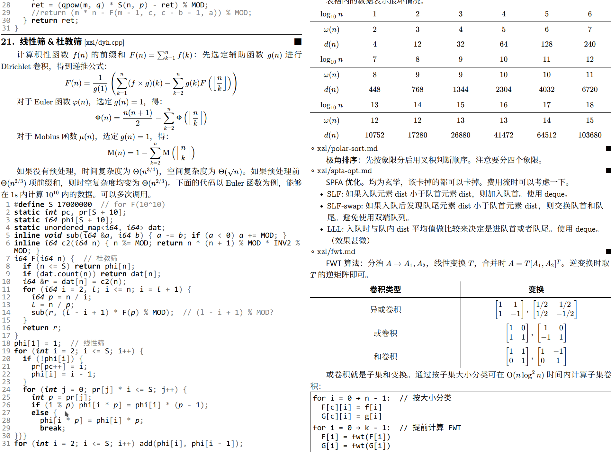

# `docmeld`
简易代码模板生成器，提供 GitHub Webhook 服务。

目前仅在 Ubuntu 18.04 下测试过，不保证其它平台的可用性。

**警告**：该项目目前处在测试版阶段，后期代码可能大量修改，不能保证向后兼容。

## 示例
[`riteme/oh-my-acm/fall19`](https://github.com/riteme/oh-my-acm/tree/fall19): <https://riteme.site/docmeld/riteme/oh-my-acm/fall19/>



目前仅支持 **C++ 源代码**和 **Markdown 的文档**以及输出为 **HTML 页面**。

## 依赖项
对于 `docmeld.py`:

* Python 2.7.15rc1
    * [Python Markdown](https://pypi.org/project/Markdown/) (PyPI, version==2.6.11)
    * [colorama](https://pypi.org/project/colorama/) (PyPI)
    * [python-clang-6.0](https://packages.ubuntu.com/bionic/python-clang-6.0) (bionic)
* [clang-6.0](https://packages.ubuntu.com/bionic/clang-6.0) (bionic)
* Git

安装依赖项（Ubuntu 18.04）：

```shell
sudo -H pip install Markdown==2.6.11 colorama
sudo apt install clang-6.0 python-clang-6.0 git
```

对于 `docmeld_webhook.py`（GitHub Webhook 服务）：

* [build-essential](https://packages.ubuntu.com/bionic/build-essential)（bionic）
* [libssl-dev](https://packages.ubuntu.com/bionic/libssl-dev)（bionic）
* [libffi-dev](https://packages.ubuntu.com/bionic/libffi-dev)（bionic）
* [python3-setuptools](https://packages.ubuntu.com/bionic/python3-setuptools)（bionic）
* Python 3.6.8
  * [wheel](https://pypi.org/project/wheel/)（PyPI）
  * [Flask](https://pypi.org/project/Flask/)（PyPI）
  * [uWSGI](https://pypi.org/project/uWSGI/)（PyPI）
  * [filelock](https://pypi.org/project/filelock/)（PyPI）
* Nginx

## 生成器使用
源代码和 Markdown 文档的设置和注意事项参见 [`riteme/oh-my-acm/fall19` 的 `README.md`](https://github.com/riteme/oh-my-acm/blob/fall19)。*配置文件 `preferences.py` 的说明文档待补充*。如果你想新建一个模板代码仓库，可以考虑使用 [`riteme/docmeld-example`](https://github.com/riteme/docmeld-example) 仓库模板（点击页面上 “Use this template” 新建仓库）。

编译本地仓库：

```shell
./docmeld.py [仓库目录]
```

默认配置下模板文件会被放置到仓库目录下的 `output.html` 文件。可以使用浏览器等其它工具缩放页面、打印为 PDF。

## GitHub Webhook 服务
`docmeld_webhook.py` 使用 Flask 实现了一个简单的 uWSGI 服务，用于监听 GitHub 上仓库的 `push` 事件。在 GitHub 上的仓库页面依次点击 “Setting” → “Webhooks” → “Add webhook” 来添加 Webhook。添加页面设置以下选项：

* `Payload URL`：Webhook 服务的 URL。
* `Content type`：选择 “`application/json`”。
* `Secret`：填入密钥。
* 其余选项保持默认值。

之后按下 “Add webhook” 按钮即可添加。添加后 GitHub 会发送一个 `ping` 事件，如果页面上没有报错即连接正常。

**警告**：由于 `docmeld` 直接使用 Python 文件作为配置文件（即 `preferences.py`），实际上 `preferences.py` 内可以执行任意代码，因此网络服务非常不安全。故建议仅提供 `secret` 给受信任的仓库。此外可以对 `preferences.py` 文件进行校验码检查。需人工检查原始文件是否安全，通过校验码避免修改，尽可能避免恶意代码的风险。*（仅是权宜之计，待改进）*

`database` 目录下存放了每个仓库对应的仓库信息，包括对应的 `secret`，以 JSON 文件储存，文件名为仓库 clone URL 的 MD5 码。JSON 文件内格式如下：

```json
{
    "secret": "...",
    "last_build": "",
    "checksums": {
        "preferences.py": "sha256=94fa456bd4834e676b78b8b118091f97f3ed60c18a54ed1d2eb5a2c4f78a9374"
    }
}
```

* `secret`: 仓库的 `secret`。
* `last_build`：记录了上次该仓库编译时的 commit 的 SHA1 值，初始为空字符串，无需改动。
* `checksums`：文件校验码列表，出现在列表中的文件均会先进行校验后再开始编译。

## TODO
* [ ] 模块化
* [ ] 支持自定义 Parser 和 Generator